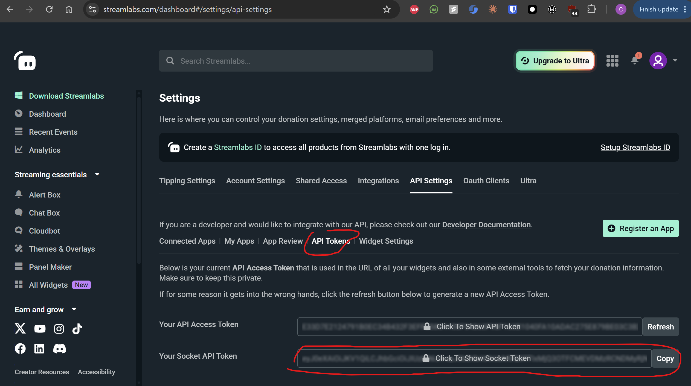

# WH3 Donation Army Spawn

A Total War: WARHAMMER III campaign mod plus a small companion app. When a viewer donates through Streamlabs, the app appends the donation to a queue file in the game folder. The mod polls that file, warns you as soon as a donation is seen, and at your next turn start spawns a hostile army of a random race, with a random lord and possibly heroes, near you. Armies are spawned as CA invasions (the game's `invasion_manager`): they march at and attack your faction leader (or your strongest army, or your capital if neither is available), are upkeep-free and immune to regionless attrition. Bigger donations spawn bigger, higher-tier, more experienced armies; every donation that meets the lowest tier spawns (no cap).

## Install the mod

1. Run `build.ps1` from the repo root (needs `rpfm_cli.exe` at `C:\dev\gaming\rpfm\rpfm_cli.exe`; edit the path at the top of `build.ps1` if yours differs). It builds `dist\donation_army.pack` and installs it.
2. Enable `donation_army.pack` in the Total War launcher's mod list.

## Mod config

Edit `mod/script/campaign/mod/donation_army_config.lua`, then rebuild with `build.ps1`.

| Key | Meaning |
| --- | --- |
| `queue_file` | Queue file name, relative to the WH3 install folder (default `donation_army_queue.txt`). Must match the app's `queuePath`. |
| `poll_interval_ms` | How often the mod checks the queue file (default 10000, i.e. 10 seconds). |
| `spawn_distance` | Spawn distance from the anchor (default 5). |
| `army_effect_bundle` | Effect bundle applied to every spawned army for its lifetime (default `wh2_dlc16_bundle_military_upkeep_free_force_immune_to_regionless_attrition`, which removes upkeep and regionless attrition). Set to `""` to disable. |
| `turn_tier_bonus` | List of `{ turn, tiers }`. From that turn on, every donation spawns that many tiers higher (tiers ordered by `min_usd`), capped at the top tier; the entry with the highest `turn` reached applies. Donations below the lowest tier are still ignored. Default `{ turn = 5, tiers = 1 }, { turn = 30, tiers = 2 }`; set to `{}` to disable. |
| `tiers` | List of `{ name, min_usd, difficulty }`. The tier with the highest `min_usd` that a donation meets wins; `difficulty` names an entry of `difficulties`. |
| `races` | Races an army may be rolled from, as roster keys (e.g. `{ "chs", "skv", "emp" }`). `nil` (default) allows every race in `donation_army_rosters.lua`. |
| `difficulties` | Army generation settings per difficulty (see below). |

Default tiers: $5 Warband (`easy`), $20 Horde (`medium`), $50 Doomstack (`hard`). From turn 5 donations spawn one tier higher ($5 gives a Horde, $20 a Doomstack) and from turn 30 two tiers higher (capped at Doomstack).

### How armies are generated

Each spawn rolls a random race from `races` (only races whose faction exists in the campaign; the mod logs the others at startup), then builds an army from that race's roster:

- A random lord of the race (generic lords only, no legendary lords), plus a random number of distinct heroes, which join the army.
- An infantry core (random melee and missile infantry counts; races without missile infantry get melee instead), then weighted random roles (cavalry, monstrous infantry/cavalry, war beasts, chariots, war machines, monsters) until the army reaches a random size. Ogres favour monstrous infantry. War machines, monsters and Regiments of Renown never appear twice.
- Units come from the difficulty's unit-tier range; when a role has no units there, the range widens by one tier.

Each `difficulties` entry has `tiers` (unit tier range, 1-5), `min_units`/`max_units` (army size including lord and heroes, at most 20), `unit_xp` (range of ranks for the invasion manager's `add_unit_experience`), `lord_level` (range passed to `add_character_experience`), and `limits`: per role `{ min, max }` (`hero`, `melee_infantry`, `missile_infantry`, `melee_cavalry`, `missile_cavalry`, `monstrous_infantry`, `monstrous_cavalry`, `war_beast`, `chariot`, `warmachine`, `monster`, `generic`). Infantry min/max set the core; other roles only use max. Defaults:

| Difficulty | Unit tiers | Size | Unit xp | Lord level | Heroes | Chariot / war machine / monster |
| --- | --- | --- | --- | --- | --- | --- |
| `easy` | 1-2 | 10-13 | 1-3 | 5-10 | 0 | none |
| `medium` | 1-3 | 14-16 | 3-5 | 10-15 | 0-1 | at most 1 each |
| `hard` | 1-5 | 17-20 | 5-7 | 15-20 | 0-2 | at most 1 each |

Rosters live in `mod/script/campaign/mod/donation_army_rosters.lua`, generated from `tools/data/land_encounters_factions_data.lua` (vanilla units, lords and heroes only). Each race spawns as its quest-battle faction (e.g. `wh_main_chs_chaos_qb1`, `wh2_main_skv_skaven_qb1`); all 23 exist in Immortal Empires. Do not edit the rosters file by hand: change the data or `tools/gen_rosters.py`, then regenerate with `python tools/gen_rosters.py` (a test fails if the committed file drifts). Unit, subtype and faction keys are in the game's DB tables `main_units_tables`, `agent_subtypes_tables` and `factions_tables` (export them from `db.pack` with RPFM; `*.tsv` at the repo root is gitignored).

Army rosters and composition rules adapted from Land Encounters and Points of Interest (Steam Workshop).

## Streamer setup

Get your Streamlabs socket token: in the Streamlabs dashboard go to **Settings → API Settings → API Tokens** ([streamlabs.com/dashboard#/settings/api-settings](https://streamlabs.com/dashboard#/settings/api-settings)) and copy **Your Socket API Token**, the second, longer token (a few hundred characters, starts with `eyJ`). Not "Your API Access Token" above it: that short one makes the app fail with `Socket error: Authentication error`. Treat it like a password; it only goes in `app/config.local.json`, which is gitignored.



## Run the app

```
cd app
npm install
copy config.example.json config.local.json   # then edit it
npm start
```

App config keys (`app/config.local.json`):

| Key | Meaning |
| --- | --- |
| `socketToken` | Your Streamlabs socket API token. Never logged. |
| `queuePath` | Full path to the queue file; must be in the WH3 install folder (where `Warhammer3.exe` is). In JSON, Windows paths need doubled backslashes (`C:\\Games\\...`) or forward slashes. |
| `currencyRates` | Map of currency code to USD rate, used to convert non-USD donations. Unknown currencies are treated as USD. |
| `acceptTestAlerts` | If true, Streamlabs test alerts are queued too (each gets a unique id). Set to `false` for live streams, or dashboard test alerts will spawn armies. |
| `logRawEvents` | If true, prints every raw Streamlabs event (may include donor messages). |

## Testing

- `python -m pytest` (repo root): Lua mod tests, plus a check that the committed rosters match `python tools/gen_rosters.py`.
- `cd app && npm test`: companion app tests.
- `cd app && npm run fake -- Bob 20`: append a fake $20 donation from Bob to the queue.
- Streamlabs dashboard "Test Alert" with the app running (needs `acceptTestAlerts: true`).
- In-game smoke test: copy `tools/console/smoke.lua` to the game folder as `exec.lua`, then type `e` in PJ's Console mod. `tools/console/spawn_probe.lua` is the same kind of probe for spawn-spot lookups and `create_force_with_general` per faction key. `tools/console/invasion_probe.lua` spawns an invasion-manager army that hunts your faction leader, the same sequence the mod uses. `tools/console/race_probe.lua` reports which per-race `_qb1` factions exist and spawns one Skaven invasion with a hero embedded via `create_agent` + `embed_agent_in_force`.

## Limits

- Donations made while the app is off are lost.
- A new campaign skips donations queued before it started.
- Loading an older save may re-spawn armies already spawned in a later save.
- The queue file lives in the game folder.
